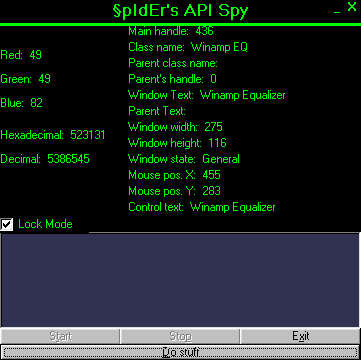

<div align="center">

## API Spy


</div>

### Description

This is an API Spy it list all sorts of information about a window that the mouse is on and has a whole lot of options for you to play with. I even added a color spyer part where it gets the color of the pixel the mouse is on. And oh yeah please take the time to vote for my Spy here it takes like 2 seconds and I would appreciate it a lot. Also I wrote an API Spy in C++; go check it out in the C++ section. Thank you! Check it out!
 
### More Info
 
Um sorry but my module is not just for the Spy its got a whole lot of other stuff in it so it may be hard to follow... sorry.


<span>             |<span>
---                |---
**Submitted On**   |2000-06-13 18:18:04
**By**             |[Adam Orenstein](https://github.com/Planet-Source-Code/PSCIndex/blob/master/ByAuthor/adam-orenstein.md)
**Level**          |Advanced
**User Rating**    |5.0 (70 globes from 14 users)
**Compatibility**  |VB 5\.0, VB 6\.0
**Category**       |[Complete Applications](https://github.com/Planet-Source-Code/PSCIndex/blob/master/ByCategory/complete-applications__1-27.md)
**World**          |[Visual Basic](https://github.com/Planet-Source-Code/PSCIndex/blob/master/ByWorld/visual-basic.md)
**Archive File**   |[CODE\_UPLOAD67726142000\.zip](https://github.com/Planet-Source-Code/adam-orenstein-api-spy__1-8922/archive/master.zip)

### API Declarations

```
Public WndWidth As Long
Public WndHeight As Long
Public Thing(0 To 510) As Long
Dim Arraycount As Integer
Public MainText As String
Public MainTextLen As Long
Public MainDC As Long, lretval As Long
Public Win As Long, MainClassName As String, ParentClassName As String
Public CurColor As RGB
Public CurPos As POINTAPI
Public Declare Function BitBlt Lib "gdi32.dll" (ByVal hdcDest As Long, ByVal nXDest As Long, ByVal nYDest As Long, ByVal nWidth As Long, ByVal nHeight As Long, ByVal hdcSrc As Long, ByVal nXSrc As Long, ByVal nYSrc As Long, ByVal dwRop As Long) As Long
Public Declare Function ReleaseCapture Lib "user32" () As Long
Public Declare Function sndStopSound Lib "winmm.dll" Alias "sndPlaySoundA" (ByVal lpszSoundName As Long, ByVal uFlags As Long) As Long
Public Declare Function GetCursorPos Lib "user32" (lpPoint As POINTAPI) As Long
Public Declare Function SetWindowPos Lib "user32" (ByVal hWnd As Long, ByVal hWndInsertAfter As Long, ByVal X As Long, ByVal Y As Long, ByVal cx As Long, ByVal cy As Long, ByVal wFlags As Long) As Long
Public Const HWND_TOP = 0
Public Const HWND_TOPMOST = -1
Public Const HWND_NOTOPMOST = -2
Public Const HWND_BOTTOM = 1
Public Const SWP_NOSIZE = &H1
Public Const SWP_NOMOVE = &H2
Public Const SWP_DRAWFRAME = &H20
Public Const SWP_FLAGS = SWP_NOSIZE Or SWP_NOMOVE
Public Declare Function SetWindowText Lib "user32.dll" Alias "SetWindowTextA" (ByVal hWnd As Long, ByVal lpString As String) As Long
Public Declare Function FindWindow Lib "user32" Alias "FindWindowA" (ByVal lpClassName As String, ByVal lpWindowName As String) As Long
Public Declare Function GetWindowDC Lib "user32" (ByVal hWnd As Long) As Long
Public Declare Function IsIconic Lib "user32.dll" (ByVal hWnd As Long) As Long
Public Declare Function IsZoomed Lib "user32.dll" (ByVal hWnd As Long) As Long
Public Declare Function WindowFromPoint Lib "user32.dll" (ByVal xPoint As Long, ByVal yPoint As Long) As Long
Public Declare Function GetWindowText Lib "user32.dll" Alias "GetWindowTextA" (ByVal hWnd As Long, ByVal lpString As String, ByVal nMaxCount As Long) As Long
Public Declare Function GetWindowTextLength Lib "user32.dll" Alias "GetWindowTextLengthA" (ByVal hWnd As Long) As Long
Public Declare Function GetParent Lib "user32.dll" (ByVal hWnd As Long) As Long
Public Declare Function PostMessage Lib "user32" Alias "PostMessageA" (ByVal hWnd As Long, ByVal wMsg As Long, ByVal wParam As Long, ByVal lParam As Long) As Long
Public Declare Function GetClassName Lib "user32.dll" Alias "GetClassNameA" (ByVal hWnd As Long, ByVal lpClassName As String, ByVal nMaxCount As Long) As Long
Public Declare Function ReleaseDC Lib "user32.dll" (ByVal hWnd As Long, ByVal hDC As Long) As Long
Public Declare Function GetWindowRect Lib "user32.dll" (ByVal hWnd As Long, lpRect As Rect) As Long
Public Declare Function BringWindowToTop Lib "user32.dll" (ByVal hWnd As Long) As Long
Public Declare Function GetDC Lib "user32.dll" (ByVal hWnd As Long) As Long
Public Declare Function GetAsyncKeyState Lib "user32.dll" (ByVal vKey As Long) As Integer
Public Declare Function GetPixel Lib "gdi32.dll" (ByVal hDC As Long, ByVal nXPos As Long, ByVal nYPos As Long) As Long
Public Declare Function EnumChildWindows Lib "user32.dll" (ByVal hWndParent As Long, ByVal lpEnumFunc As Long, ByVal lParam As Long) As Long
Public Declare Function MessageBox Lib "user32.dll" Alias "MessageBoxA" (ByVal hWnd As Long, ByVal lpText As String, ByVal lpCaption As String, ByVal uType As Long) As Long
Public Declare Function EnumWindows Lib "user32.dll" (ByVal lpEnumFunc As Long, ByVal lParam As Long) As Long
Public Declare Function SendMessage Lib "user32" Alias "SendMessageA" (ByVal hWnd As Long, ByVal wMsg As Long, ByVal wParam As Long, lParam As Any) As Long
'these constants are for PostMessage as well
Public Const WM_CHAR = &H102
Public Const WM_CLOSE = &H10
Public Const WM_CREATE = 1
Public Const WM_COMMAND = &H111
Public Const WM_GETTEXT = &HD
Public Const WM_GETTEXTLENGTH = &HE
Public Const WM_KEYDOWN = &H100
Public Const WM_KEYUP = &H101
Public Const WM_LBUTTONDBLCLK = &H203
Public Const WM_LBUTTONDOWN = &H201
Public Const WM_LBUTTONUP = &H202
Public Const WM_RBUTTONDBLCLK = &H206
Public Const WM_RBUTTONDOWN = &H204
Public Const WM_RBUTTONUP = &H205
Public Const WM_SETTEXT = &HC
Public Const WM_SYSCOMMAND = &H112
Public Const WM_DESTROY = 2
Public Const WM_MOVE = 3
Public Const WM_SIZE = 5
Public Const WM_PAINT = &HF
Public Const WM_DRAGFORM = &HA1
Public Declare Function EnableWindow Lib "user32.dll" (ByVal hWnd As Long, ByVal fEnable As Long) As Long
Public Const EW_Enable = 1
Public Const EW_DISABLE = 0
Public Declare Function ShowWindow Lib "user32" (ByVal hWnd As Long, ByVal nCmdShow As Long) As Long
Public Const SW_HIDE = 0
Public Const SW_SHOW = 5
Public Const SW_MINIMIZE = 6
Public Const SW_MAXIMIZE = 3
Public Const SW_RESTORE = 9
Public Type Rect
 Left As Long
 Top As Long
 Right As Long
 Bottom As Long
End Type
Public Type RGB
 Red As Long
 Green As Long
 Blue As Long
End Type
Public Type POINTAPI
 X As Long
 Y As Long
End Type
these are the ones the spy uses my module has these and many more... again sorry
```


